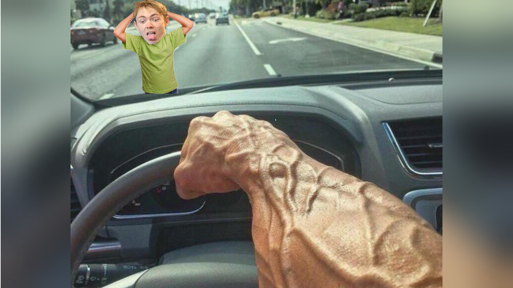
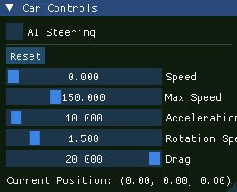
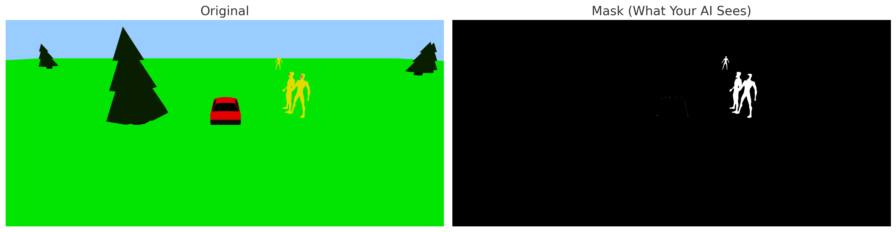

## Project Overview
Auto-Slaughter is a "game" where the goal is to drive over every human. The game can be controlled classically with keyboard inputs but also has an AI mode where the car drives itself and hunts down humans using computer vision.
The game is primarily a Tech demo, so I am very aware it is a terrible game, but rather a demonstration of my skills in C++ and computer vision using OpenCV.

## Controls
- WASD to move
- Press "AI Steering" button to toggle Auto detection<br>

- Press the Reset button to restart the game


## UML Diagram


<div align="center">
(White classes are external classes that i did not create)
</div>

## Features
- Dynamic movement of the car 
- AI mode that detects humans and drives over them
- Reset button to restart the game
- Powerup when driving over a human (decreases the turn speed of the car)
- Sound effects by Magnus Evenstuen


# Code information

### Foreword: 
A lot of stuff in this project is done in a weird or unneeded way. Often the reason behind this was that I wanted to show/learn that I can do it, or as a wise man once said:<br>
**"But, but why?** <br>
**Because fun."**

### Notes:
- ImGui’s setup is more complicated than necessary because it was implemented before discovering threepp’s built-in ImGui integration. But since it doesn't affect the project negatively, I left it as is.
  <br/><br/>
- Why are some libraries fetched using CMake FetchContent and others using external libraries? while OpenCV uses vcpkg <br>
  - Because I wanted to show that I can use all these methods. And OpenCV has too large files for GitHub so I had to use vcpkg.


## Human Detection System
The game uses OpenCV's colour detection method to determine where the humans are, converting frames into a format the computer can parse easily.



### How It Works
1. Capture the current game frame.
2. Convert the frame from BGR to HSV colour space.
3. Apply a yellow colour filter to isolate humans:
   ```cpp
   cv::inRange(
       hsv_,
       cv::Scalar(20, 100, 50),
       cv::Scalar(35, 255, 255),
       mask_
   );
   ```
4. Extract contours from the mask and compute bounding boxes.
5. Select the human whose bounding box centre is closest to the screen centre as the active target.

### Sources:

Coding examples for OpenCV were found here: https://github.com/opencv/opencv/tree/4.x/samples/cpp/example_cmake
Magnus Evenstuen for voicing all sounds in the game, and for using his face in the human model


"Lowpoly Human Reff" (https://skfb.ly/ot8Cu) by fadhlisl is licensed under Creative Commons Attribution (http://creativecommons.org/licenses/by/4.0/). Edited by me to include the Face
3D model "Low-Poly Car" by wufudufu — downloaded from Free3D (https://free3d.com/3d-model/low-poly-car-40967.html), accessed 15.10.2025.
"Prism Stone - Magical Energy Stone" (https://skfb.ly/6S6oL) by ENOMIC is licensed under CC Attribution-NonCommercial-ShareAlike (http://creativecommons.org/licenses/by-nc-sa/4.0/). Edited by me to change the texture to black and blue